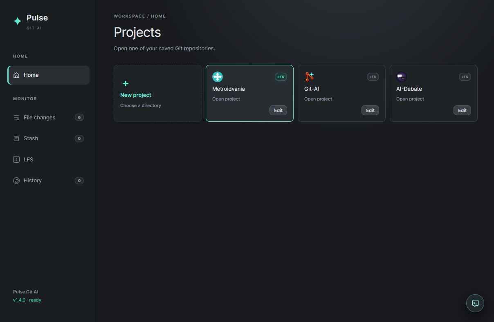
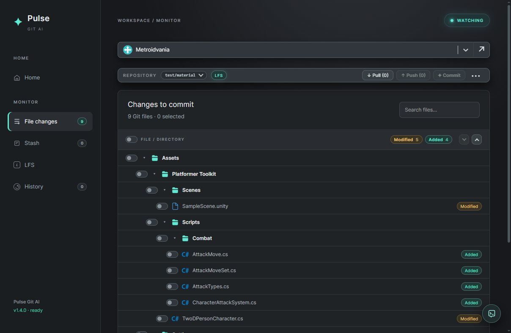
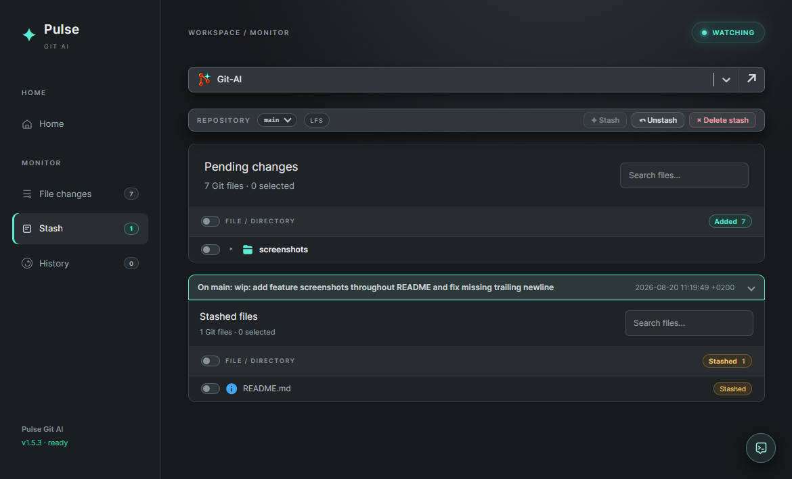
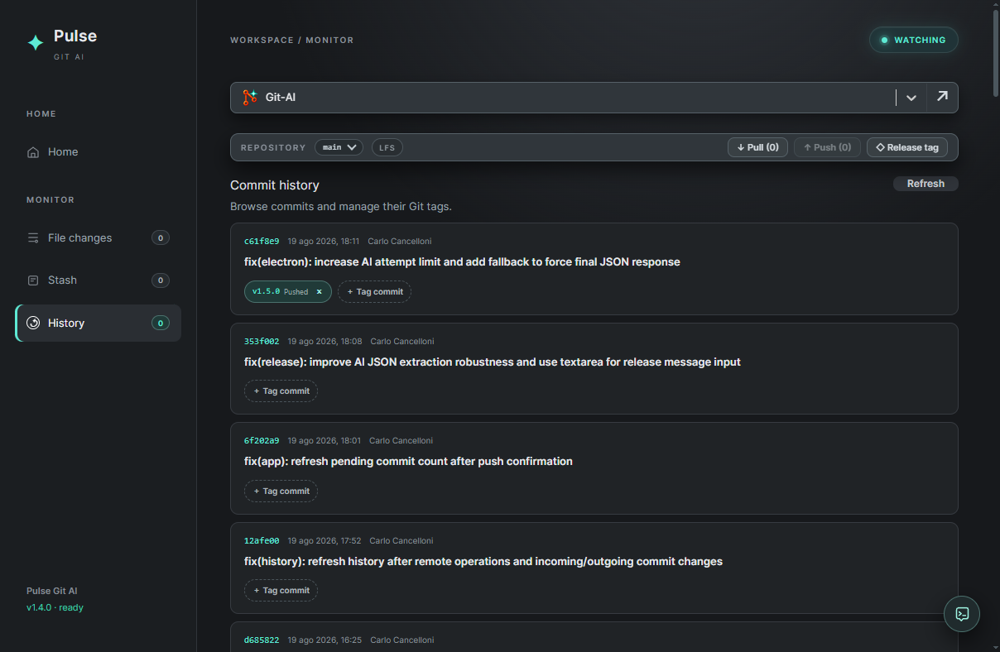
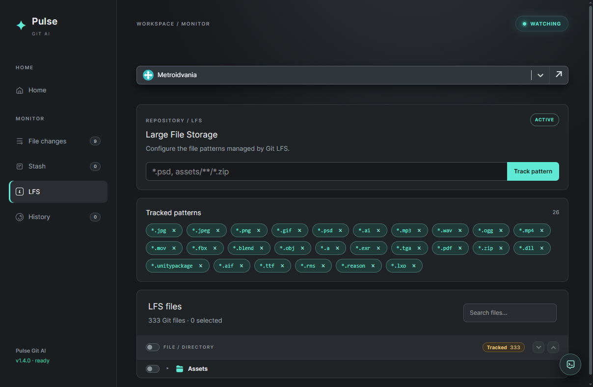
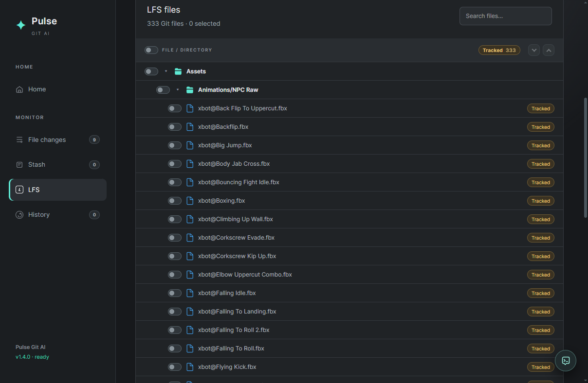
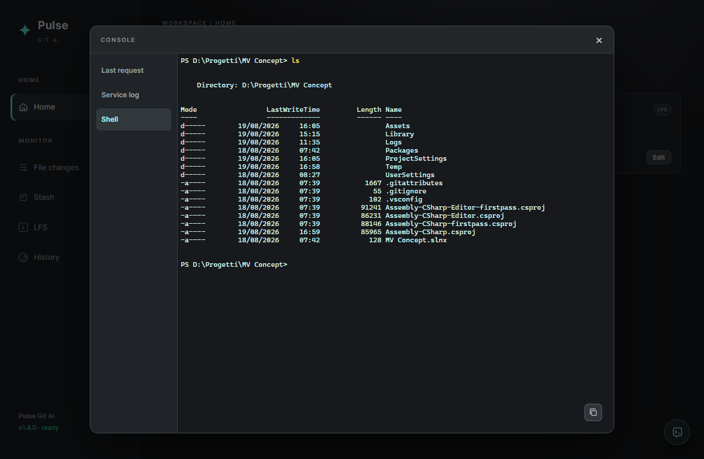

# Pulse Git AI

**Artist oriented. Lazy oriented. Developer controlled.**

Pulse Git AI is a lightweight desktop Git client focused on fast repository management and AI-assisted workflows.

It is designed for the part of Git that tends to become tedious after large refactors: reviewing changed files, selecting exactly what belongs in a commit, understanding diffs, and producing clear commit messages without losing control over what is actually committed.

Pulse does not decide what you want to commit. You select the files. AI analyzes the selected changes and helps describe them.

It is especially comfortable for artists, game developers and technical creatives working with repositories that contain not only code, but also textures, audio, 3D assets and Git LFS-managed files.

And it is deliberately **lazy-oriented**.

Not "hide Git from me" lazy.

More like:

> "I just changed twelve files, added four more, deleted two, and I really don't want to reconstruct all of that just to write a decent commit message."

Select the files, click Commit, let Pulse inspect the actual diff together with added and deleted files, review the generated message, and commit.

The final decision always remains yours.

There is also a very specific workflow Pulse tries to make less annoying:

> You start working.  
> You enter hyperfocus.  
> Forty minutes later you realize you are still on the wrong branch.

Instead of turning that into a small Git archaeology session, Pulse provides stash, AI-generated stash descriptions, branch switching and selective restore workflows aimed at getting the work where it was supposed to be.

**ND-friendly by accident. Or maybe not.**

ADHD tax: reduced.  
Git knowledge: still useful.  
Shame: optional.

## Features

### Repository monitoring

Add local repositories and keep their working state visible in real time.

Pulse tracks:

- modified files
- added and untracked files
- deleted files
- current branch
- incoming and outgoing commits
- Git LFS status

Repositories can also be initialized directly from Pulse or checked out from a remote URL.



### AI-assisted commits

Select the files that belong together and generate a commit message from their actual changes.

Pulse uses the selected diff together with added and deleted files to generate concise commit messages suitable for Conventional Commits.

The generated message remains editable before committing.



Typical workflow:

```text
Select files
    ↓
Review diff
    ↓
Generate commit message
    ↓
Edit if needed
    ↓
Commit
```

Commit amend is also supported for the latest local commit.

### Branch management

Switch between local and remote branches directly from the repository toolbar.

Pulse can also stash current changes before switching branches, making it easier to recover work started on the wrong branch.


### Stash management

Pulse provides a dedicated stash workflow instead of treating the stash as an opaque stack.

Supported operations include:

- create stashes including untracked files
- AI-generated stash messages
- restore a complete stash
- restore only selected files from a stash
- restore multiple stashes
- merge multiple stashes into a new stash
- AI-generated messages for merged stashes
- delete individual or multiple stashes

This makes stashes usable as temporary structured work rather than a collection of anonymous `WIP on branch` entries.



### Commit history and tags

Browse local commit history and unpublished commits.

Pulse supports:

- local commit history
- pending commits not yet pushed
- tag creation
- annotated tags
- tag publishing
- local tag deletion
- amend of the latest commit message
- release tag generation

When AI is enabled, Pulse can analyze changes since the previous release and propose a release tag and release message.



### Git LFS

Git LFS can be enabled and managed directly from Pulse.

The LFS view provides:

- repository LFS status
- tracked patterns
- adding new LFS patterns
- removing existing patterns
- list of files currently managed by LFS

Patterns are applied using the native Git LFS configuration rather than maintaining a separate Pulse-specific configuration.





### Integrated terminal

Pulse includes an embedded terminal opened directly in the active repository directory.

On Windows it uses PowerShell through a native PTY, so normal Git commands and project tooling remain available without leaving the application.



### Git remote operations

Common repository operations are available directly from the UI:

- pull
- push
- branch switch
- remote branch checkout
- revert selected changes

The application also displays incoming and outgoing commit counts for the current tracking branch.

## AI

Pulse currently integrates with Ollama.

Configure the Ollama endpoint and model from:

```text
File → Settings…
```

AI is used as an assistant for operations such as:

- commit message generation
- stash message generation
- merged stash message generation
- release tag and release message generation

Git operations themselves remain explicit and under user control.

## Requirements

- Git
- Node.js
- Ollama, if AI features are required
- Git LFS, if LFS features are required

Desktop builds are available for Windows, macOS and Linux. Git must be installed and available on the system `PATH`; Git LFS is required only for repositories that use LFS. The integrated terminal uses PowerShell on Windows and the user's default shell on macOS/Linux.

## Development

Install dependencies:

```bash
npm install
```

Start Vite and Electron in development mode:

```bash
npm run dev
```

Build the frontend:

```bash
npm run build
```

Build the Windows desktop installer:

```bash
npm run dist:desktop
```

Build the macOS desktop package (run on macOS):

```bash
npm run dist:mac
```

Build Linux packages (`AppImage` and `deb`, run on Linux):

```bash
npm run dist:linux
```

Run the Electron application against an existing build:

```bash
npm start
```

## Tech stack

- Electron
- React
- Vite
- Tailwind CSS
- xterm.js
- node-pty
- Ollama
- native Git CLI

## Philosophy

Pulse Git AI is not intended to replace Git or hide how Git works.

Its goal is to remove repetitive work around Git while keeping the developer in control of repository state and commit boundaries.

The AI describes the work.

You decide what the work is.

## License

See [LICENSE](LICENSE) for the applicable license terms.

## Support

If you find this project useful and want to support its development:

[Buy me a coffee](https://buymeacoffee.com/achilleterb)
